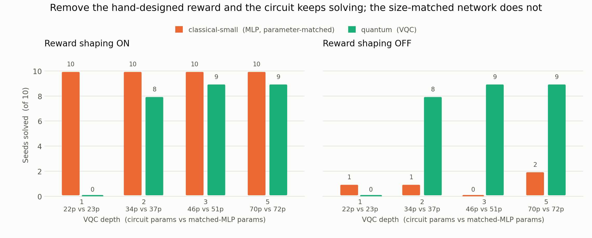

# Hybrid Quantum-Classical DQN for CartPole-v1

A Deep Q-Network agent for `CartPole-v1` where the Q-function approximator is
**swappable**: either a classical PyTorch MLP or a parameterized quantum
circuit (Qiskit `EstimatorQNN` wrapped in a `TorchConnector`, trained through a
fast PyTorch statevector backend). Everything else — replay memory,
epsilon-greedy exploration, target network, Huber loss, the training loop — is
shared, so the two agents are compared on equal footing, and the same trained
circuit can be replayed on real IBM Quantum hardware.

Built for the 2026 NTU "Scaling for Quantum Advantage and Beyond" hackathon.
Everything here is open source (MIT), including a reproducible IBM hardware run
on a free IBM Quantum account.

## Results

Ten seeds per cell, 100,000 environment steps each. "Solved" means the
**greedy** policy (ε=0) averaged ≥475 over 100 unseen episodes. The
`classical-small` arm is sized per depth to hold *just more* parameters than
the circuit it is matched against, so the classical net is never the smaller of
the two. Committed under `results_drl/nlayer<N>[-no-rwshp]/`.

<picture>
  <source media="(prefers-color-scheme: dark)" srcset="results_drl/shaping_robustness-dark.png">
  
</picture>

**The circuit's advantage is robustness to reward design, not parameter
efficiency.**

- **With** a dense hand-designed reward, the parameter-matched MLP wins
  outright: 10/10 seeds at every depth, against at most 9/10 for the circuit.
  There is no parameter-efficiency story — at equal budget the MLP is better.
- **Without** it, on CartPole's bare +1-per-step, the ranking inverts: the
  circuit holds 9/10 at depths 3 and 5 and 8/10 at depth 2, while the
  size-matched MLP collapses to 0–2/10.
- The oversized `classical` baseline (1,282 parameters, in the table below —
  left out of the figure, where it solves nearly everything and flattens the
  axis) barely notices the change: 10/10 → 9/10. So shaping-independence isn't
  unique to the circuit. It is what the *small* MLP lacks and raw capacity buys
  back; the circuit gets it at 70 parameters instead of 1,282.

### What that looks like during training


Unshaped at depth 5, the right-hand panel is the one to read — it tracks the
greedy policy, which is what "solved" is judged on. The circuit climbs and then
**stays** there — its median curve never drops below 321 over the last 40k
steps. The classical baseline reaches the bar and then destroys its own policy,
its median falling to 88 and never recovering past 320.

That difference is masked by the headline numbers, because training restores
the best checkpoint before the final measurement. Median greedy evaluation at
the *end* of training, against the reported score:

| Arm | Median final eval | Median reported | Seeds rescued by checkpoint restore |
|---|---:|---:|---:|
| `quantum` | 472 | 500 | 4/10 |
| `classical` | 130 | 500 | 6/10 |
| `classical-small` | 9 | 123 | 2/10 |

So `classical`'s 9/10 unshaped is real but fragile — it is largely the
best-checkpoint machinery recovering a policy the run had already thrown away.
The circuit is still near the bar when training stops.

### Depth 5 in detail

| Arm | Params | Median | Mean | Min | Max | Solved | Steps | Wall |
|---|---:|---:|---:|---:|---:|---:|---:|---:|
| `classical` | 1,282 | 500.0 | 500.0 | 500 | 500 | **10/10** | 56,604 | 28 s |
| `classical-small` | 72 | 500.0 | 500.0 | 500 | 500 | **10/10** | 67,300 | 29 s |
| `quantum` | 70 | 498.1 | 492.5 | 471 | 500 | 9/10 | 79,448 | 698 s |
| `quantum-noisy` | 70 | 356.9 | 344.3 | 205 | 498 | 1/10 | 100,190 | 726 s |

Three caveats worth carrying:

- **Shot noise degrades, it doesn't destroy.** `quantum-noisy` holds a median
  357 shaped and 415 unshaped — far above a random policy — but clears the
  solve bar on at most 1 seed in 10.
- **Depth 1 is unusable** (0/10 in both conditions), so the useful range is
  depths 2–5.
- **Training cost is the circuit's real price:** ~25x the classical
  wall-clock. It also trains on more steps, because arms stop on the solve
  criterion rather than at a common step count — the `steps` column makes that
  visible.

Regenerate everything with `run_sweep.py` and this figure with
`plot_robustness.py`. Each cell directory also holds a `benchmark_curves.png`
(median training curve, inter-seed spread shaded, legend annotated with
parameter count and depth).

## Quickstart

```bash
pip install -r requirements.txt
cd main
```

> **Always prefix runs with these three environment variables.** They are not
> optional tuning — without them a run is ~2x slower, and it gets *worse* on
> bigger hardware. See [Troubleshooting: slow runs](#troubleshooting-slow-runs).
>
> ```bash
> CUDA_VISIBLE_DEVICES="" OMP_NUM_THREADS=1 OMP_WAIT_POLICY=PASSIVE python <script> ...
> ```

Run the full benchmark:

```bash
python run_experiment.py                     # 4 arms, 1 seed
python run_experiment.py --seeds 0 1 2 3 4   # averaged over 5 seeds
python run_experiment.py --smoke             # wiring check, ~3 min
python run_experiment.py --arms quantum      # one arm only
```

Or train a single agent:

```bash
python cartpole_dqn.py --agent classical --tag _zoo
python cartpole_dqn.py --agent quantum --tag _quantum
```

Useful flags: `--seed` (default 0), `--total-steps`, `--lr`, `--train-freq`,
`--gradient-steps`, `--target-update-every-steps`, `--eps-end`, `--double-dqn`,
`--tag`, `--out-dir`. Always pass a distinct `--tag` so runs write to separate
files instead of overwriting each other.

Each run writes `results/<name>_run.json` (per-episode rewards and mean loss,
wall-clock, parameter count, seed, greedy-eval results, solved flag),
`results/<name>_training.png`, and `results/<name>_policy.pt`. The benchmark
adds a combined `benchmark.json`, `benchmark_curves.png`, and a solved-policy
GIF per arm.

Animate a trained checkpoint:

```bash
python watch.py --checkpoint results/classical_zoo_policy.pt --out results/cartpole_solved.gif
```

> **Note:** this uses `gymnasium`, not the legacy `gym`. The APIs differ —
> `reset()` returns `(obs, info)` and `step()` returns five values
> `(obs, reward, terminated, truncated, info)`.

All commands assume you are inside `main/` — the scripts import each other as
siblings (`import cartpole_dqn`, `from vqc import ...`). The classical baseline
only needs `torch`, `gymnasium`, `numpy`, `matplotlib`; the quantum agent adds
`qiskit` and `qiskit-machine-learning`; the noisy arm adds `qiskit-aer`; real
hardware adds `qiskit-ibm-runtime`.

## The four experiment arms

The obvious comparison is "classical vs. quantum," but the conventional
classical baseline is far wider than CartPole's 4-in/2-out interface needs.
Beating it with a ~70-parameter circuit would say more about the baseline being
oversized than about quantum efficiency. So the benchmark trains four networks
under identical conditions:

| Arm | Network | Params (n-layers=5) | What it shows |
|---|---|---:|---|
| `classical` | MLP, hidden=(32,32) | 1,282 | The conventional, deliberately oversized baseline |
| `classical-small` | MLP, hidden=(10,) | 72 | The **honest** like-for-like comparison — auto-sized per depth to just exceed the circuit |
| `quantum` | VQC, exact statevector | 70 | The quantum circuit on an exact (noise-free) simulator |
| `quantum-noisy` | VQC + finite-shot sampling | 70 | The same circuit under measurement noise — what shot noise costs |
| `ibm` *(opt-in)* | trained `quantum` checkpoint | 70 | Deployment evidence: the frozen policy replayed on a real QPU |

`classical` vs. `classical-small` shows how much of the "classical baseline"
result is just parameter count. `classical-small` vs. `quantum` is the fair
fight. `quantum` vs. `quantum-noisy` isolates hardware-realistic sampling
noise, still on a simulator (no QPU time spent). `ibm` is the only arm that
doesn't train.

For the quantum arms, "layers" is `--n-layers` (VQC depth), not an MLP width.

`classical-small`'s width is **not fixed** — `run_experiment.py` derives it from
`--n-layers` as the narrowest hidden layer whose parameter count just exceeds
that depth's circuit, and prints the pairing at startup. Sizing it below the
VQC would hand the quantum arm exactly the advantage this arm exists to remove:

| `--n-layers` | VQC params | `classical-small` | Params | Margin |
|---:|---:|---|---:|---:|
| 1 | 22 | hidden=(3,) | 23 | +1 |
| 2 | 34 | hidden=(5,) | 37 | +3 |
| 3 | 46 | hidden=(7,) | 51 | +5 |
| 5 | 70 | hidden=(10,) | 72 | +2 |

Pass `--classical-small-hidden` to pin it manually.

### Flags worth knowing

- `--n-layers` (default 5) — VQC depth; also sets the quantum and
  `classical-small` parameter counts quoted above.
- `--quantum-backend torch|qiskit` — `torch` (default) is the fast statevector
  path (~7 ms/gradient step, single-threaded CPU); `qiskit` is ~1900x slower
  and only practical on `--smoke`, to confirm the two agree.
- `--noisy-shots` (default 1024) — finite-sampling noise for `quantum-noisy`.
- `--reward-shaping` / `--no-reward-shaping` — dense centering/velocity shaping
  on top of the native reward, applied identically to every arm.
- `--stop-on-eval` — stop as soon as the greedy policy clears the bar (see
  below).
- `--out-dir` — where every artifact lands.

Treat a single-seed result as indicative, not conclusive: the committed
classical runs include both a solve (greedy 500.0) and a failure (greedy 111.4)
at identical settings. Pass several `--seeds` to get the median and spread that
a real comparison should rest on.

## How the comparison stays fair

### One integration point

The *only* thing that differs between the classical and quantum runs is the
network itself, so there is exactly one seam, in `main/cartpole_dqn.py`:

```python
def build_q_network(agent: str) -> nn.Module:
    if agent == "classical":
        return ClassicalQNetwork()
    elif agent == "quantum":
        return VQCQNetwork()   # EstimatorQNN + TorchConnector
```

Any network satisfying this contract drops in with **no other changes**:

| | Requirement |
|---|---|
| Type | `torch.nn.Module` |
| Input | `(batch, 4)` float32, observations already normalized to `[-1, 1]` |
| Output | `(batch, 2)` — one Q-value per action |
| Gradients | must flow to `.parameters()` (the loop calls `.backward()`) |

Verify a network satisfies it before wiring anything up:

```bash
python test_interface.py
```

### Observation normalization is shared, deliberately

`normalize_obs()` clips and scales the four CartPole observations to roughly
`[-1, 1]`. Cart position and pole angle are physically bounded, but both
velocities are not — near failure the env returns large values.

This lives in the shared wrapper, not inside either network, because the
quantum circuit's **angle encoding requires bounded inputs** (an unbounded
value would wrap around the Bloch sphere and alias to a different state), and
the classical net trains more stably with the same treatment. Putting it in one
place keeps the comparison honest.

### Matched step budgets, on purpose

Early stopping is **off** in the benchmark. `cartpole_dqn.train()` on its own
stops as soon as a run's greedy policy clears the solve bar, which is right for
a single run — but across four arms it would let each train for a different
number of steps, so a weaker score might only mean that arm quit sooner. Pass
`--stop-on-eval` if you want sample-efficiency (steps-to-solve) instead of
quality-at-a-fixed-budget; the summary prints mean step count per arm either
way, so an unmatched comparison stays visible.

### Solved is judged on the greedy policy, not training reward

CartPole-v1 counts as solved at mean reward 475 over 100 episodes. This repo
evaluates that on the **greedy** policy (ε=0) after training, as SB3 and
RL-Baselines3-Zoo do — not on the training reward curve.

That distinction is not pedantic. Training reward is collected with exploration
still active, and because updates happen in bursts of 128 gradient steps the
policy changes discontinuously between logged episodes. In one run the training
log read ~10 while the actual policy scored 468 at ε=0.04. Judging by the
training curve would have been badly wrong in both directions.

### Hyperparameters

The defaults are the [RL-Baselines3-Zoo tuned CartPole-v1 DQN
config](https://github.com/DLR-RM/rl-baselines3-zoo/blob/master/hyperparams/dqn.yml),
ported rather than hand-tuned. The structurally important part is the update
schedule: **128 gradient steps every 256 environment steps, against a target
network synced every 10 steps** — fit hard against a frozen target, then
refresh. An earlier version did one gradient step per environment step against
a 20k buffer, which overfits the network to the narrow band of states the
current policy happens to visit; its greedy policy scored 111 while its
exploring policy scored 353.

## Troubleshooting: slow runs

**Symptom:** training crawls on a big workstation — often *slower than a
laptop* — while `nvidia-smi` shows the GPU near idle and `top` shows a python
process at 1000%+ CPU across dozens of threads. Both readings are the same
story: the work is tiny and sequential, so every extra core and every CUDA
kernel launch is overhead rather than help.

**Fix:** prefix every run with

```bash
CUDA_VISIBLE_DEVICES="" OMP_NUM_THREADS=1 OMP_WAIT_POLICY=PASSIVE python <script> ...
```

Same 303 episodes / ~56,900 steps, quantum arm, `--n-layers 5`:

| Configuration | Throughput |
|---|---:|
| Workstation, defaults (CUDA auto-selected, 24 OpenMP threads) | 97.4 steps/s |
| Workstation, prefix above | 157.3 steps/s |
| Laptop, defaults | 202.7 steps/s |

**`CUDA_VISIBLE_DEVICES=""`** forces CPU. `cartpole_dqn.py` auto-selects CUDA
whenever it is present, but the VQC statevector is 8 KB (16 amplitudes × batch
64, complex64) pushed through ~92 strictly sequential gates. That workload is
kernel-launch-bound, not compute-bound: a launch costs ~3 µs of fixed overhead
to wrap roughly 0.16 ns of arithmetic, and the gates cannot overlap because
each consumes the previous one's output. Measured 197 s on an RTX 5090 vs 90 s
on CPU for the same 5,000-step run. A faster GPU does not help; only much
larger batches or kernel fusion (CUDA graphs, `torch.compile`) would.

**`OMP_NUM_THREADS=1`** stops torch opening a parallel region around every tiny
op. The gate sequence has no parallelism to exploit, but torch defaults to one
OpenMP thread per core, and each op then pays a spin-wait barrier across all of
them. Per gradient step, 24 threads vs 1: **9.01 ms vs 6.76 ms** on an idle
machine, degrading to **272.71 ms vs 7.60 ms** when the cores are contended.

**`OMP_WAIT_POLICY=PASSIVE`** makes idle OpenMP threads sleep instead of
spin-wait, so a stray thread pool cannot burn cores it is not using.

Measured on a 24-core Threadripper PRO 7965WX + RTX 5090 (Linux). The penalty
scales with core count, so a run that is inexplicably slower on the bigger
machine is almost always this.

## Running on real IBM Quantum hardware

The `ibm` arm doesn't train — it loads a trained `quantum` checkpoint and
replays one greedy episode on a real QPU, one Runtime Estimator job per
environment step. It is deployment evidence, not a fifth result: one capped
episode isn't comparable to the local arms' full evaluation, so it's opt-in
(`--arms ibm`) and needs exactly one seed.

Setup uses IBM's free-tier Quantum Platform: credentials, saving the account
locally, a zero-QPU-time dry run that validates transpilation, then the
evaluation itself. There is also a manifest-reviewed pipeline if you want to
inspect exactly what will be submitted before spending QPU time.

**→ [docs/ibm_hardware.md](docs/ibm_hardware.md)** for the full walkthrough.

## Two bugs worth knowing about

Both are easy to write, both silently break training, and neither raises an
error. They are documented here because they cost us most of a day.

**1. Target-network syncing measured in episodes.** In CartPole reward equals
episode length, so as the policy improves episodes get *longer*. An
episode-based sync interval therefore stretches the target network's staleness
in proportion to how well the agent is doing — maximum staleness at maximum
Q-value magnitude. This produced a textbook divergence: reward climbed to a
mean of ~200, then collapsed to 60 and never recovered. Sync on **steps**.

**2. Treating truncation as termination.** gymnasium ends a CartPole episode
with two distinct flags: `terminated` (the pole fell — a real MDP terminal
state) and `truncated` (the 500-step time limit — the pole is still balanced).
Storing `done = terminated or truncated` in the replay buffer zeroes the
bootstrap target for exactly the agent's best states, teaching it that a
perfectly balanced pole is worthless. Store **`terminated` only**. The replay
field is named `terminated` here so the distinction is hard to reintroduce.

## Repository layout

| Path | Purpose |
|---|---|
| `main/cartpole_dqn.py` | The agent, training loop, and the `build_q_network` seam |
| `main/vqc.py` | The VQC Q-network: circuit, encoding, observables, PyTorch wrapper |
| `main/torch_statevector.py` | Fast exact statevector executor used during training |
| `main/torch_density.py` | Differentiable noisy (density-matrix) executor, calibrated from a real device |
| `main/run_experiment.py` | The four-arm benchmark harness described above |
| `main/run_sweep.py` | Regenerates every `results_drl/` cell (depths x shaping), in parallel |
| `main/plot_robustness.py` | Renders the shaping-robustness figure at the top of this file |
| `main/run_qiskit_sim.py` | Rehearses a trained checkpoint through actual Qiskit simulators |
| `main/eval_shots.py` | Measures the cost of finite-shot sampling on a trained policy |
| `main/watch.py` | Renders a trained checkpoint as an animated GIF |
| `main/vqc_checkpoint.py` | Loads a checkpoint into any execution backend |
| `main/ibm_backend_inference.py` | Transpiles/validates the VQC for an IBM backend, no QPU time |
| `main/run_ibm_cartpole.py` | Fast-path hardware evaluation (used by `run_experiment.py --arms ibm`) |
| `main/{evaluate_ibm_policy,prepare_ibm_policy_submission,run_ibm_policy_evaluation,summarize_ibm_policy_evaluation}.py` | The manifest-reviewed hardware pipeline |
| `main/test_interface.py` | Contract check — run before dropping in a new network |
| `tools/setup_ibm_account.py` | GUI helper to save IBM Quantum credentials locally |
| `tools/test_ibm_connection.py` | GUI helper to verify the saved account and list QPUs |
| `tools/build_ibm_backend_report.py` | Builds a report from collected IBM artifacts |
| `requirements.txt` | Pinned, verified-working dependency versions |
| `mypy.ini` | Type-check config (per-package stub ignores for untyped Qiskit/reportlab) |
| `docs/ibm_hardware.md` | Full IBM Quantum hardware walkthrough |
| `results_drl/` | Committed sweep results (JSON, curves, robustness figure) |
| `circuit_docs/` | Rendered circuit diagrams |

## License

MIT — see `LICENSE`.
