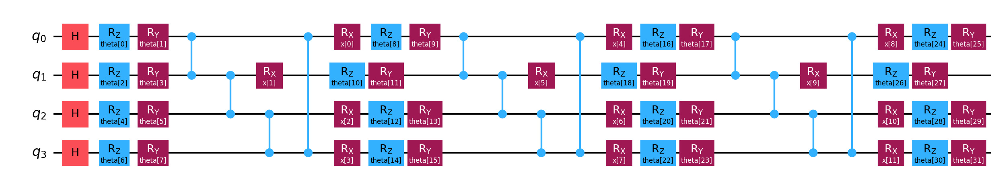

# VQC Q-Network Architecture and Execution Results

`vqc.py` implements the quantum Q-network used by the CartPole DQN agent. It is a PyTorch `nn.Module` that maps a batch of four-dimensional CartPole observations to two Q-values, one for each action:

```text
(batch, 4) CartPole states -> VQCQNetwork -> (batch, 2) Q-values
```

The reinforcement-learning code only depends on this input-output interface, allowing the quantum execution backend to be changed without modifying the DQN logic.

## 1. Model Specifications

- Qubits: 4, one per CartPole observation feature
- Actions: 2, corresponding to pushing the cart left or right
- Variational blocks: 3
- Initial state preparation: Hadamard gate on every qubit
- Trainable rotations: `RZ(theta)` followed by `RY(theta)`
- Entanglement: circular CZ ring
- Data encoding: trainable-scaled `RX` data re-uploading in every block
- Final layer: one additional `RZ-RY` rotation pair per qubit
- Observables: `Z0Z1` and `Z2Z3`, one per action
- Circuit rotation parameters: 32
- Input-scaling parameters: 12
- Output-scaling parameters: 2
- Total trainable parameters: 46

## 2. Program Architecture

### 2.1 Hyperparameters

```python
N_QUBITS = 4
N_LAYERS = 3
N_ACTIONS = 2
CIRCUIT_IMAGE = "vqc_circuit.png"
```

The four qubits correspond to the four CartPole state components:

```text
q0 <- cart position
q1 <- cart velocity
q2 <- pole angle
q3 <- pole angular velocity
```

### 2.2 Circuit Construction

`build_qnetwork_circuit()` creates the parameterized circuit and returns:

- `circuit`: the complete Q-network circuit
- `encoding_params`: 12 data-encoding parameters, ordered by layer and qubit
- `weight_params`: 32 trainable rotation parameters

The circuit starts by applying a Hadamard gate to every qubit. Each of the three variational blocks then performs:

1. An `RZ(theta)` and `RY(theta)` pair on every qubit.
2. A circular CZ ring: `q0-q1`, `q1-q2`, `q2-q3`, and `q3-q0`.
3. One `RX(x)` data-encoding gate on every qubit.

After the third block, a final `RZ-RY` layer is applied without another entanglement or encoding stage.

The circuit contains four rotation layers in total. Each layer has two parameters per qubit:

```text
(3 variational blocks + 1 final layer) x 4 qubits x 2 rotations = 32 theta parameters
```

### 2.3 Why the Rotation Order Matters

Each rotation pair applies `RZ` before `RY`. A final `RZ` gate commutes with a Z-type observable and can therefore become a dead parameter with zero gradient. Ending each pair with `RY` prevents the final rotation from commuting with the measurement.

### 2.4 Circular Entanglement

Each block uses a circular CZ ring rather than a linear chain. The closing `CZ(q3, q0)` connection places qubit 0 inside the full entanglement structure and allows the observables' backward light cones to cover all four qubits.

This avoids the feature blindness found in simpler linear circuits, where some inputs and trainable parameters may have no influence on the output.

### 2.5 Data Re-uploading and Input Scaling

CartPole observations are first bounded with `arctan`:

```python
encoded = torch.arctan(state)
```

This keeps unbounded velocity features within a useful rotation-angle range. The bounded features are then multiplied by trainable input-scaling parameters:

```python
angles = input_scale * encoded
```

There is one scaling parameter for every layer-feature pair:

```text
3 layers x 4 features = 12 lambda parameters
```

The scaled state is uploaded again in every variational block. This data re-uploading increases the circuit's expressive power by introducing higher-order trigonometric feature interactions.

### 2.6 Observables and Action Outputs

`build_observables()` creates two observables:

```python
"IIZZ"  # Z0 Z1 -> action 0
"ZZII"  # Z2 Z3 -> action 1
```

Qiskit Pauli strings use little-endian qubit ordering, so qubit 0 is the rightmost character. The two expectation values form the two action outputs produced by `EstimatorQNN`.

Using two observables with complementary light cones ensures that every circuit parameter affects at least one output. The current 46-parameter network has no structurally dead trainable parameters.

### 2.7 PyTorch Integration

`VQCQNetwork` inherits from `torch.nn.Module`. `TorchConnector` wraps the `EstimatorQNN`, allowing the circuit parameters and input-scaling parameters to participate in PyTorch automatic differentiation.

The QNN is configured with:

```python
input_gradients=True
default_precision=0.0
```

`input_gradients=True` is required because gradients must pass through the encoded angles to the trainable input-scaling parameters. Exact expectation values are used to keep execution deterministic.

### 2.8 Output Scaling

Raw quantum expectation values are limited to `[-1, 1]`, but CartPole Q-values can become much larger. The network therefore multiplies each action output by its own trainable scale:

```python
return expectations * output_scale
```

These two output-scaling parameters allow the model to represent Q-values outside the physical expectation-value range.

### 2.9 Optimizer Parameter Groups

`parameter_groups()` exposes three parameter groups with separate learning rates:

| Parameter group | Default learning rate | Purpose |
|---|---:|---|
| Circuit rotations (`theta`) | `1e-3` | Learn the variational circuit |
| Input scaling (`lambda`) | `1e-3` | Learn feature encoding scales |
| Output scaling (`w`) | `1e-1` | Learn the Q-value magnitude |

The larger output-scale learning rate helps the network quickly expand beyond the `[-1, 1]` expectation-value range.

## 3. Quantum Circuit Diagram



The diagram is generated directly by `vqc.py`. Running the program overwrites `vqc_circuit.png`, keeping the documented circuit synchronized with the implementation.

The main circuit flow is:

```text
Hadamard initialization
        |
[RZ-RY -> circular CZ -> scaled RX encoding] x 3
        |
Final RZ-RY layer
        |
Measure Z0Z1 and Z2Z3
        |
Two scaled Q-values
```

## 4. Forward-Pass Execution Result

The `main()` function evaluates three CartPole-like observations:

```python
[
    [ 0.0,  0.0,  0.00,  0.0],
    [ 0.5, -1.2,  0.05,  0.8],
    [-2.4,  3.0, -0.20, -2.5],
]
```

Running the current implementation with seed `0` produced:

```text
circuit rotation params (theta) : 32
input scaling params (lambda)   : 12
output scaling params (w)       : 2

Q-values shape: (3, 2)
[[ 0.2843006  -0.08677849]
 [-0.05736617 -0.20007975]
 [-0.10119658  0.12873921]]
```

Each row corresponds to one input state, and each column corresponds to one CartPole action. For example, the third state currently assigns a larger Q-value to action 1 than to action 0.

These values come from an initialized network and are not evidence of a trained policy. The DQN training loop is responsible for updating the network toward Bellman targets.

## 5. Gradient-Safe Design Choices

Four architectural choices are essential:

1. **Circular entanglement** prevents qubits from falling outside the observables' light cones.
2. **`RZ` before `RY`** prevents a trailing rotation from commuting with Z-type measurements.
3. **Two complementary observables** ensure that all circuit parameters affect at least one action output.
4. **Trainable output scaling** allows the network to represent Q-values larger than one.

Finite-difference and TorchConnector gradient checks found zero dead parameters in the current 46-parameter architecture.

## 6. Running the Program

Create an environment, install the repository requirements, and run:

```bash
python3 -m venv .venv
.venv/bin/python -m pip install -r requirements.txt
.venv/bin/python vqc.py
```

The program prints the circuit, regenerates `vqc_circuit.png`, reports the parameter counts, and performs a forward pass on three sample states.

Qiskit may report that it is automatically creating a gradient function. This is an informational message rather than an execution error.

## 7. Difference from `vqc_v0.py`

| Component | `vqc_v0.py` | `vqc.py` |
|---|---|---|
| Purpose | Teaching binary classifier | CartPole DQN Q-network |
| Encoding | One `RY` encoding layer | Scaled `RX` re-uploading in every block |
| Variational blocks | 2 | 3 plus a final rotation layer |
| Entanglement | Circular CX | Circular CZ |
| Observables | One local `Z0` output | `Z0Z1` and `Z2Z3` action outputs |
| Input scaling | None | 12 trainable parameters |
| Output scaling | Maps output to `[0, 1]` | Two trainable unbounded Q-value scales |
| Total trainable parameters | 16 | 46 |
| Structurally dead parameters | 2 | 0 |
