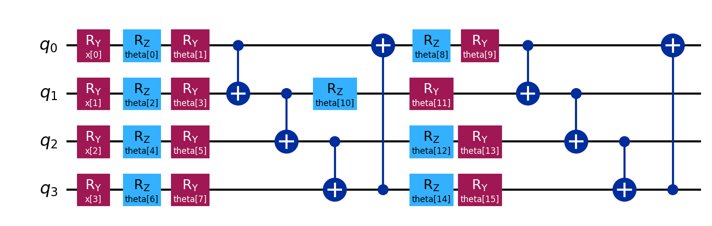

# VQC v0 Architecture and Execution Results

`vqc_v0.py` is a minimal Variational Quantum Circuit (VQC) example built with Qiskit and PyTorch. It wraps a parameterized quantum circuit as a PyTorch model and trains it on a synthetic binary classification task.

## 1. Model Specifications

- Number of qubits: 4
- Number of input features: 4
- Data encoding: one `RY(x[i])` gate on each qubit
- Number of trainable layers: 2
- Trainable gates per layer: `RY(theta)` and `RZ(theta)`
- Entanglement pattern: linear CX chain
- Total number of trainable parameters: 16
- Output observable: Pauli-Z expectation value on qubit 0
- Optimizer: Adam with a learning rate of 0.1
- Loss function: Binary Cross-Entropy Loss
- Training duration: 30 epochs

## 2. Program Architecture

### 2.1 Dependencies and Random Seeds

The program uses NumPy to generate data and initialize parameters, PyTorch to manage the model, loss function, and optimization process, and Qiskit to construct the parameterized quantum circuit.

The NumPy and PyTorch random seeds are both set to `0`, making the generated dataset, initial weights, and training results reproducible.

### 2.2 Hyperparameters

```python
N_QUBITS = 4
N_LAYERS = 2
ENTANGLE_MODE = "linear"
```

`ENTANGLE_MODE` can be set to either `linear` or `circular`. Circular mode adds a CX gate from the final qubit back to the first qubit in every trainable layer.

### 2.3 VQC Construction

The `build_vqc_circuit()` function creates two parameter groups:

- `x_params`: four parameters representing the input data.
- `theta_params`: the trainable model weights, with `2 layers x 4 qubits x 2 rotations = 16` parameters.

The circuit first applies `RY(x[i])` gates to encode the input features into the quantum state. Each trainable layer then applies `RY` and `RZ` rotations, followed by CX gates that create entanglement between the qubits.

### 2.4 PyTorch Model Wrapper

`VQCModel` inherits from `torch.nn.Module`. It uses `TorchConnector` to convert the `EstimatorQNN` into a quantum layer that participates in PyTorch automatic differentiation.

The Pauli-Z expectation value produced by the quantum circuit is in the range `[-1, 1]`. The forward pass maps it to `[0, 1]`:

```python
return (raw + 1) / 2
```

The mapped value can be used directly as a binary classification probability.

### 2.5 Observable

```python
observable = SparsePauliOp.from_list([("IIIZ", 1)])
```

Qiskit Pauli strings use little-endian qubit ordering. Therefore, `IIIZ` represents a Pauli-Z measurement on qubit 0.

### 2.6 Synthetic Dataset

The program generates 40 four-dimensional samples. Each feature is drawn uniformly from `[-pi, pi]`. Labels are assigned using the following rule:

```text
sum(x) > 0  -> label 1
sum(x) <= 0 -> label 0
```

This is a simple linearly separable task designed to verify that the VQC and PyTorch integration, forward pass, and backward pass work correctly.

### 2.7 Training Process

Each epoch performs the following steps:

1. Clear the gradients from the previous iteration.
2. Pass all 40 training samples through the VQC.
3. Calculate the Binary Cross-Entropy Loss.
4. Use `loss.backward()` to calculate gradients for the quantum-circuit parameters.
5. Use Adam to update the `theta` parameters.
6. Display the loss and accuracy every five epochs.

## 3. Quantum Circuit Diagram



The circuit proceeds from left to right as follows:

1. Encode the input with `RY(x[0...3])` gates.
2. Apply the first trainable `RY(theta) + RZ(theta)` rotation layer.
3. Apply the first linear CX chain: `q0 -> q1 -> q2 -> q3`.
4. Apply the second trainable `RY(theta) + RZ(theta)` rotation layer.
5. Apply the second linear CX chain.
6. Measure the Pauli-Z expectation value on qubit 0 as the model output.

## 4. Execution Output

Running the model for 30 epochs in the project `qiskit_env` environment produced the following results:

```text
Epoch  0 | Loss: 0.6617 | Acc: 0.62
Epoch  5 | Loss: 0.5284 | Acc: 0.75
Epoch 10 | Loss: 0.5252 | Acc: 0.80
Epoch 15 | Loss: 0.5334 | Acc: 0.80
Epoch 20 | Loss: 0.5289 | Acc: 0.82
Epoch 25 | Loss: 0.5222 | Acc: 0.80
Epoch 29 | Loss: 0.5208 | Acc: 0.77
```

## 5. Result Interpretation

- The loss decreased from `0.6617` to `0.5208`, indicating that the model learned part of the classification rule.
- Accuracy improved from `62%` and reached a maximum of `82%` at epoch 20.
- The final accuracy was `77%`, showing some fluctuation during the later training epochs.
- The fluctuations may be related to the small dataset of only 40 samples, the absence of a separate validation set, and the relatively high learning rate of `0.1`.
- The reported accuracy is training accuracy and should not be interpreted as generalization performance on unseen data.

## 6. Running the Program

Run the program from the repository directory using a Python environment with Qiskit Machine Learning and PyTorch installed:

```bash
python vqc_v0.py
```

Qiskit may display a message indicating that it is automatically creating a gradient function. This is an informational message, not an execution error.
